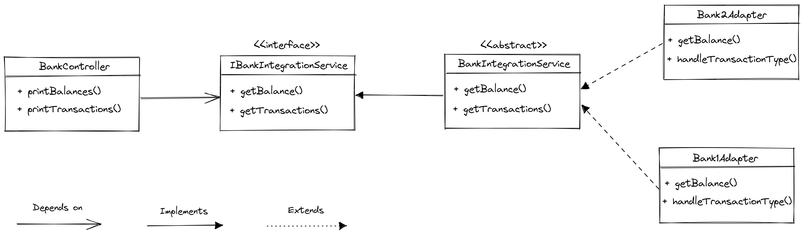
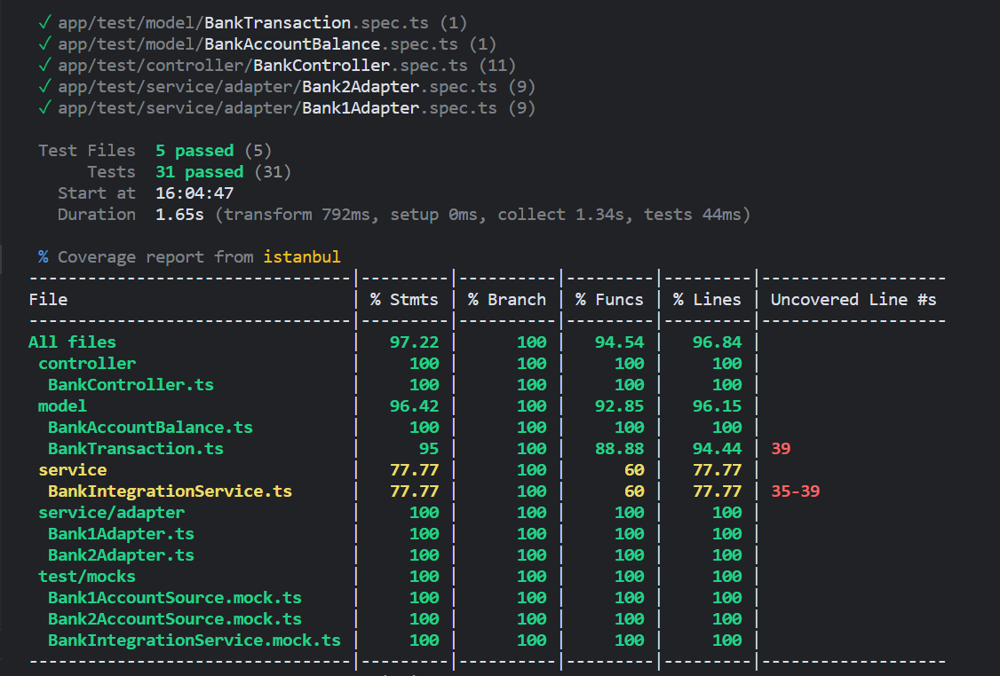

# Bank integrations display

  *A simple bank aggregation application that pulls information from multiple different banks and displays it. The challenge here is that we don’t want the BankController to ever directly use any classes in the `com.bank1` and `com.bank2` packages*

## Design 
In order to isolates `BankController` from bank1 and bank2 implementation details, this class depends only to an standard interface `IBankIntegrationService`. This interface defines the necessary methods to bring all information needed from all banks integrations, transformed in the domain data structure. 

To do this, I took advantage of the **Dependency Injection** design pattern to avoid the high level of code coupling between my controller and the services. Thus, the controller depends on an **interface** and not directly an specific **implementation**. As you can see in the diagram below:



In this way, the services that communicates with `Bank1` and `Bank2` need to implement the interface for a `BankIntegrationService`. Since they both expose functionality to fetch account balances and transactions, I used the **Adapter** pattern to build the services that implement the standard interface defined in the application.

I also noticed that the way the transactions are returned are the same between the banks, as well as the implementation necessary to map them in Transactions of the client application's domain. So, I decided that having an abstract `BankIntegrationService` class could help with reusability. In this way, each `BankAdapter` only needs to worry about implementing what is specific to its own domain, leaving the class they inherit from.

At last, the `BankAdapters` also take advantage of Dependency Injection: by transferring the responsibility of instantiating the specific classes of `BankAccountSource` to whoever instantiates the Adapters.

## Setup & Run

This Node.js project uses typescript, which will be automatically installed as a development dependency. However, make sure your environment has the following at least:
- [node.js](https://nodejs.org/en/download/)
- npm

Install all project dependencies

```bash
npm install
```
This application uses environment variables as required inputs. In order to run it, you need to create an file named `.env` and put all variables required (see the `.env.example` file):

```bash
ACCOUNT_NUMBER=
FETCH_TRANSACTIONS_FROM_DATE=
FETCH_TRANSACTIONS_TO_DATE=
```

Then, execute the application to print all balances and transactions from current Bank Integrations

```bash
npm start
```

## Test

I took advantage of the project to test a new test library that I had never used: [Vitest](https://vitest.dev/), as an alternative to the well-known [Jest](https://jestjs.io/).

### *Why `vitest`? 

*To test typescript files, we need to transpile them during testing. Vitest do that natively, so we don't need to deal with the complexity of transforming source files. Watch mode is enabled by default, aligning itself with the way Vite pushes for a dev first experience. Also, Vitest cares a lot about performance and uses Worker threads to run as much as possible in parallel.*

I found it interesting and it turned out to be really useful and fast.


Execute the following command to run all test suites and log mocked results:

```bash
npm test
```

In order to see a test coverage report, run:

```bash
 npm run test:coverage
```

Then, you should see the results like this:


